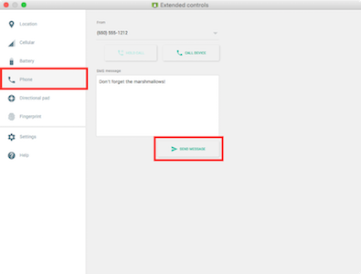

# Yet Another Messaging App ("Yama")
Android apps do not exist in a vacuum: they sit alongside a variety of other apps and functionality provided by the phone, as well as interaction elements that are (ideally) standardized by the platform itself. For this assignment, you will build an app that harnesses this ecosystem and interfaces with other app components. Specifically, as the majority of Android devices are phones and have the telephony capabilities as such, you'll build a messaging app&mdash;that is, an application for sending and receiving SMS/MMS messages. To try and separate your app from all the others out there, yours will include the secret sauce of **automated replies**, allowing the user to specify a message that is automatically sent back on receipt of a message (cause no other app can do that right? _RIGHT?_). And to make your app more "modern" and usable, you'll include some addition UI widgets provided by the Android platform.


### Objectives
By completing this challenge you will practice and master the following skills:

* Using intents to communicate between activities and applications
* Responding to implicit intents and broadcasts
* Harnessing Android telephony classes to send, receive, and display SMS messages
* Displaying notifications
* Allowing users to specify settings and preferences
* _Learning_ and using Android UI widgets and patterns

## User Stories
The user stories for this Yet Another Messaging App are:

* As a user, I want to be able to send a text message
* As a user, I want to pick a contact I can message
* As a user, I want to be notified when I receive a text message
* As a user, I want to view a list of messages I have received
* As a user, I want to be able to _automatically_ send a message in reply to one received.
* As a user, I want to customize the automatic reply in the application settings
* As a user, I want to interact with my application using Android-specific UI widgets


### Overall User Interface
Your application should have at least two different activities: one for **reading messages** and one for **composing messages** (either of these can include fragments). You will also need to have a [**Settings** Activity](http://developer.android.com/guide/topics/ui/settings.html) (see below for details).

The **reading messages** Activity should allow the user to see a list of messages received (all messages---not just the ones sent from this app). For each message, the user should be able to see the _author_ of the message, the _body_ of the message, and the _date_ (and time) when the message was sent.

- SMS messages are short enough that it is possible to include all this information for each item in a `ListView`. Alternatively, you could make a "detail" fragment or use a pop-up dialog to show additional information. If you do use a dialog or fragment, make sure that the "back" button still works!

The **composing messages** Activity should allow the user to specify the recipient (phone number) and write out a message to send, as well as actually send it! After sending a message, the inputs should be "cleared" so that the user can write a new message. You are _not_ required to include a list of sent messages (though you can if you want--it's basically the same as the list of received messages!)

- Note that the user will also need to be able to "search" for a recipient by opening the contacts list. A [simple button](http://developer.android.com/reference/android/widget/ImageButton.html) with a [search icon](http://androiddrawables.com/Menu.html) next to the phone number field is a nice way to do this.


### Working with SMS
SMS (Short Messaging Service) is one of the most widely used forms of data communication. In Android (since API 19), SMS capabilities are provided through an [API](http://developer.android.com/reference/android/provider/Telephony.html). This API specifies a number of `Intents` (think: event messages) that occur as part of sending and receiving messages: see [Sms Intents](http://developer.android.com/reference/android/provider/Telephony.Sms.Intents.html) and the API linked for details.

Android systems have a _default SMS app_ defined by the user: this app has control over the `SMS Provider`, which basically keeps track of messages that are coming in and out of the system. Only the default app can respond to the ["delivered"](http://developer.android.com/reference/android/provider/Telephony.Sms.Intents.html#SMS_DELIVER_ACTION) intent when a message arrives and manage the list of messages sent and received (e.g., delete them).

But the goal of this assignment is not to create a full app capable of effectively serving as the default app; however, it will be able to mirror a number of features. Other apps are still able to respond to the ["received"](http://developer.android.com/reference/android/provider/Telephony.Sms.Intents.html#SMS_RECEIVED_ACTION) intent (primarily to handle things like data transmission over SMS), and can have the default app send messages on your behalf. You can access the default app as an [`SmsManager`](http://developer.android.com/reference/android/telephony/SmsManager.html) object (look at the `.getDefault()` method).

The `SmsManager` class has methods capable of **sending** SMS messages, making the process fairly straightforward. Note that to send an SMS your application will need the `SEND_SMS` permission. This is a _dangerous_ permission, so in Marshmallow you would need to confirm permission at runtime.

- You should specify a [`PendingIntent`](http://developer.android.com/reference/android/app/PendingIntent.html) that notifies _your_ app when the message has been sent---especially so that you can let the user know (e.g., via a UI element) if there was an error sending the message. You can check the status of the message by calling `getResultCode()` in the `Activity` or `BroadcastReceiver` that receives the `PendingIntent`. See [Using a PendingIntent](http://developer.android.com/guide/components/intents-filters.html#PendingIntent). You can use the same `BroadcastReceiver` you use to receive messages, or you can <a href="http://developer.android.com/reference/android/content/Context.html#registerReceiver(android.content.BroadcastReceiver, android.content.IntentFilter)">register</a> one specifically for this task.


**Receiving** an SMS is a bit more complicated. You will need to create and specify a [`BroadcastReceiver`](http://developer.android.com/reference/android/content/BroadcastReceiver.html), which will let you respond to "broadcasted" Intents (like the one that occurs when a message is [received](http://developer.android.com/reference/android/provider/Telephony.Sms.Intents.html#SMS_RECEIVED_ACTION)). You should subclass `BroadcastReceiver` and declare your `<receiver>` in the manifest (along with the proper [Intent Filter](http://developer.android.com/guide/components/intents-filters.html#Receiving) to receive the implicit intent). In this receiver, because you're using API 19 or later, you can use the <a href="http://developer.android.com/reference/android/provider/Telephony.Sms.Intents.html#getMessagesFromIntent(android.content.Intent)">getMessagesFromIntent</a> to easily fetch a list of [`SmsMessage`](http://developer.android.com/reference/android/telephony/SmsMessage.html) objects from the Intent. This will allow you to process "received" messages!

- Older versions of Android make this much more painful, and involves a lot of typecasting.

- You will need the `RECEIVE_SMS` permission to receive SMS in your application, and `READ_SMS` to read the content of the message. Again, these are a _dangerous_ permissions, so in Marshmallow you would need to confirm them at runtime.


Finally, you can get a **list** of SMS messages that are on the phone by querying the
`ContentProvider` for the [SMS Inbox](http://developer.android.com/reference/android/provider/Telephony.Sms.Inbox.html). This will involve the same process that you used to query the `TodoListProvider` from the last assignment.


#### Testing SMS
The easiest way to test that your SMS functionality work is by sending and receiving messages with another phone (which is why partners are useful).

The emulator is ___not___ capable of sending or receiving external SMS messages. However, the emulator ___is___ capable of sending and receiving messages _to emulators running on the same computer_ (including itself!). This makes it possible to test SMS capabilities on the emulator, if a little awkward.

To test **sending** a message, you can have the emulator send a message to _itself_. The emulator's "phone number" is simply the 4-digit port number of the emulator. You can find this number by looking at the `Run` tab of the the output window at the bottom of Android Studio (where you normally find Logcat): when you first launch an emulator, you should see a message like:

```
Device connected: emulator-5554
```

This says that the emulator is running on port `5554` (the default). If you send a text message _from_ the emulator to this port number, it should be also received by the emulator. You can find this message in the inbox (you can go to the built-in Messaging app to see a list of messages received). If your SMS sent successfully, it should be there!

- You can also see a list of send messages by accessing the [SMS Outbox](http://developer.android.com/reference/android/provider/Telephony.Sms.Outbox.html) content provider; e.g., as a temporary replacement for your inbox list, or even as an additional activity or fragment!


Testing how your emulator **receives** messages is a lot easier, particularly with the latest version of the Android [emulator](http://developer.android.com/tools/devices/emulator.html)s. If you click on the "extra options" button (the three dots at the bottom) in the emulator's toolbar , then click on the `Phone` tab, you can access a screen that lets you send SMS messages to and even fake call the virtual device!

 

It is also possible to access the emulator from the command-line via `telnet` through the [emulator console](http://developer.android.com/tools/help/emulator.html#console). This console includes commands for [sending SMS](http://developer.android.com/tools/help/emulator.html#sms) and even [specifying location](http://developer.android.com/tools/help/emulator.html#geo) (it's basically the command-line version of the above GUI menu).


### Looking up Contacts
Your application will need to allow the user to select one of their contacts to send a message to (because who remembers phone numbers?!). While it is possible to [access and search the Contacts data directly](http://developer.android.com/training/contacts-provider/index.html) a cleaner method that fits with the goal of practicing with `Intents` is to instead ask the _Contacts_ or _People_ app to open and let the user select a contact. See [Getting Results from an Activity](http://developer.android.com/training/basics/intents/result.html) for a detailed walkthrough.

- While most of this code is provided for you, I recommend you re-type it out on your own using your own 10 fingers. It's a good way to make sure you understand what code is being called and what all the pieces do!

In summary, you'll need to create an `Intent` to `PICK` a contact from the "contacts" content provider (this is yet another `ContentProvider`). You can then start a new Activity with this Intent, but using the `startActivityForResult()` method in order to get a response _back_ from that Activity!

When the requested Activity is finished, the `onActivityResult()` callback in _your_ Activity (the Activity that sent off the Intent) will be executed. In this method you can then query the Contacts `ContentProvider`, again similar to how you did with SMS messages. You can get the Uri of the _individual contact_ (think a webpage on a specific web server) by calling `getData()` on the passed in `data`, then use the `ContentResolver` to query that particular content. The `Cursor` returned will let you get information about the contact selected (you're interested in the [`Phone.NUMBER`](http://developer.android.com/reference/android/provider/ContactsContract.CommonDataKinds.Phone.html#NUMBER), which is actually buried in the `ContactsContract.CommonDataKinds` package).

The overall interaction should be that the user hits a "search" button and the "Contacts" app opens. The user selects a contact, and then is taken back to _your_ messaging activity to find the correct phone number entered so that the message is ready to send!

Note that if you're working on the emulator, you'll need to add some Contacts for this to make any sense! You can do this through the "People" app (the little blue book with a people icon in the launcher menu).


### Notifications
When a message is received, you will need to create a [Notification](http://developer.android.com/training/notify-user/build-notification.html) so that the user knows it has arrived. Your notification doesn't need to be complex: it should include the `author` and `body` of the message (and a small icon would be nice). The user should be able to click on the notification and be taken to the **reading messages** screen (or the detail screen for that message, if you're using detail fragments).

- As extra credit, you could add a ["Big View"](http://developer.android.com/training/notify-user/expanded.html) style that supports both navigation to the **reading messages** screen AND navigation to the **compose message** screen (e.g., a "reply" button).

- If the user jumps to a particular fragment from the notification, you should [preserve the expected navigation](http://developer.android.com/guide/topics/ui/notifiers/notifications.html#NotificationResponse) by specifying the back stack!

- The notification should be shown on the [lock screen](http://developer.android.com/guide/topics/ui/notifiers/notifications.html#lockscreenNotification). But since messages are usually private, you should use the API 21's visibility settings to keep it `PRIVATE`.

To create a notification, you should use the [`NotificationCompat.Builder`](http://developer.android.com/reference/android/support/v4/app/NotificationCompat.Builder.html) class. This will work similar to the `AlertDialog.Builder` class, in that you can call various setters on it to specify what kind of notification is built. As part of this, you'll need to specify a `PendingIntent` for what to do when the notification is clicked. Finally, you can issue the notification though the [`NotificationManager`](http://developer.android.com/training/notify-user/build-notification.html#notify).

- You are not required to ["update"](http://developer.android.com/training/notify-user/managing.html#Updating) the notification if more messages arrive later, though that's a nice touch!

See the [Notifications API Guide](http://developer.android.com/guide/topics/ui/notifiers/notifications.html) for further details.


### Settings
For this messaging app, the user should be able to specify an "auto-reply" message, as well as whether automatic replies should occur. The user should be able to choose this behavior by using a [Settings](http://developer.android.com/guide/topics/ui/settings.html) menu.

You should provide this settings menu as a [`PreferenceFragment`](http://developer.android.com/reference/android/preference/Preference.html) class (_not_ a `PreferenceActivity`, though the Fragment will need to exist inside an Activity. See [the guide](http://developer.android.com/guide/topics/ui/settings.html#Fragment) for details). The Settings activity should be shown when the user selects an option from the [Options Menu](http://developer.android.com/guide/topics/ui/menus.html) (making this a `never` shown menu item is a nice way to go).

Your Preferences need to include two elements: whether the user has turned on auto-reply (a [`Switch`](http://developer.android.com/reference/android/preference/SwitchPreference.html) is nice for this), and what message they have specified to auto-reply with (e.g., through an [`EditText`](http://developer.android.com/reference/android/preference/EditTextPreference.html)). The layout for these preferences should be defined as an XML resource (e.g., as `res/xml/preferences.xml`)

By using a `Preference` object, the values specified will be automatically saved inside your application's [`SharedPreferences`](http://developer.android.com/training/basics/data-storage/shared-preferences.html) file, which is another form of persistent storage (e.g., whenever you change a setting Android automatically changes a file on the phone to reflect that). You can then [access and read data](http://developer.android.com/guide/topics/ui/settings.html#ReadingPrefs) from this file by simply calling a getter to fetch the  `SharedPreferences` object and then to further methods such as `getString()` to fetch data from that object.

- Thus you can access a variable in this file to determine whether you should send an auto-reply, and if so what message to send.

- In case it isn't clear, you can auto-reply by having your broadcast receiver send an SMS back to the number it received a message from (in addition to showing a notification)!

Even though there are only two items, your Settings should still follow the [Android Design Guidelines](https://www.google.com/design/spec/patterns/settings.html#).


### UI Widgets
Lastly, in order to make your app feel more "modern", you should include at least **one (1)** UI widget or interaction pattern that is provided in the latest Android APIs. Some potential elements you may use include:

- A [Snackbar](http://developer.android.com/training/snackbar/showing.html) for displaying actionable in-app notifications (such as for when a message is send or errors)
- A [floating action button](http://developer.android.com/reference/android/support/design/widget/FloatingActionButton.html) for launching new activities (such as the "compose" screen)
- A [context menu](http://developer.android.com/guide/topics/ui/menus.html#context-menu), such as for interacting with messages in your list view (perhaps you can long-click to reply?)
- [Swipe to refresh](http://developer.android.com/training/swipe/index.html) capabilities for your message list (though the `Loader` will automatically update the list if it changes)
- An [action bar search input](http://developer.android.com/training/search/setup.html), such as for "filtering" messages in a list view
- A [progress bar or indicator](http://developer.android.com/reference/android/widget/ProgressBar.html) (e.g., if it takes time to send a message)
- [Tabs](http://developer.android.com/training/implementing-navigation/lateral.html) for navigating between fragments
- A slide-out [naigation-drawer](http://developer.android.com/training/implementing-navigation/nav-drawer.html) for navigating between fragments

Which one(s) you include are up to you (**note**: the first two are almost trivial to add, and are good options if you're running out of time). The goal here is two-fold:

1. For you to be _aware_ of some of the options available to you. At least look at all of the links to get a sense for what kind of user interaction they support, even if you don't actually implement them. That way as you think about future projects, you have an idea of user interface patterns that are documented and supportable.

2. Practice reading and using the documentation to add features on your own.

The Android platform changes rapidly, with new interaction paradigms and support widgets added in each new release. In order to do real-world Android development, you need to be able to understand these APIs and figure out how they fit into an overall application. This is a chance for you to do that once (or twice!) when you have resources to ask for help if needed.

